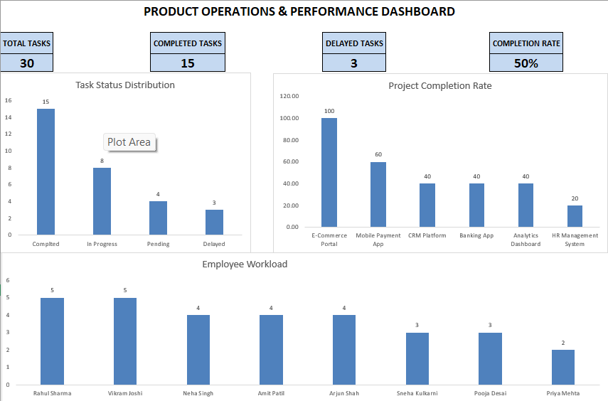
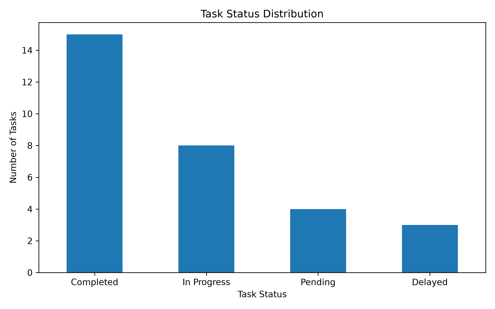
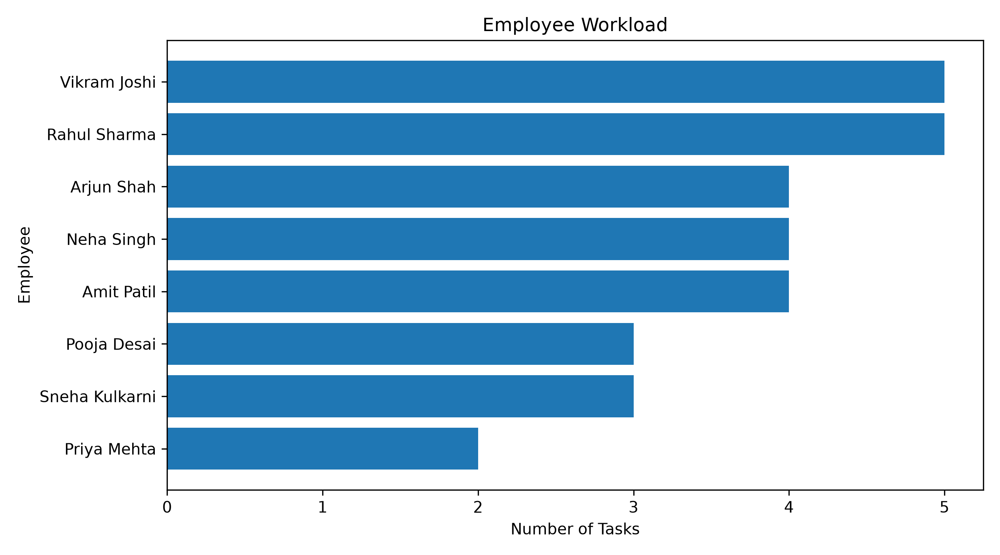
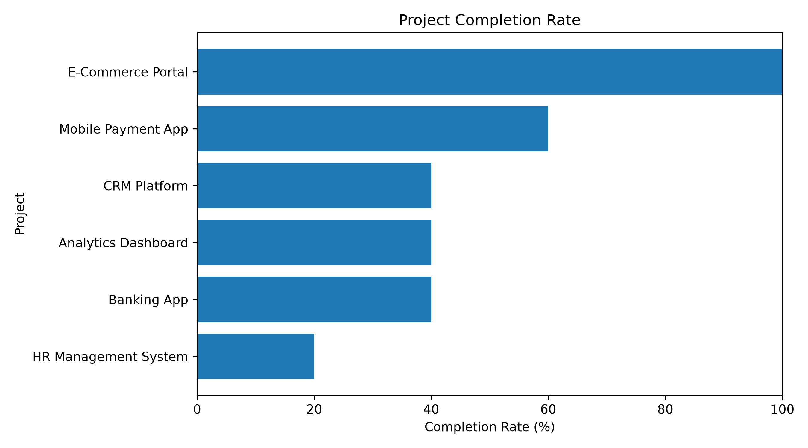

# 📊 Product Operations & Performance Dashboard

An end-to-end Data Analytics project built using **MySQL, Python (Pandas), Matplotlib, and Excel** to monitor project execution, employee workload, task status, and operational KPIs.

## 📌 Project Overview

This project simulates a Product Operations team managing multiple client projects. The workflow includes database creation, SQL analysis, Python-based data processing, KPI generation, and an Excel dashboard.

## 🚀 Tech Stack

- MySQL
- Python
- Pandas
- Matplotlib
- Excel

## 📈 Dashboard Preview



## 📊 Key KPIs

| KPI | Value |
|------|------:|
| Total Tasks | 30 |
| Completed Tasks | 15 |
| Delayed Tasks | 3 |
| Completion Rate | 50% |

## 📷 Visualizations

### Task Status Distribution



### Employee Workload



### Project Completion Rate



## 💡 Business Insights

- Managed **30 operational tasks** across **6 client projects**.
- Overall completion rate reached **50%**.
- E-Commerce Portal achieved **100% project completion**.
- Rahul Sharma and Vikram Joshi had the highest workload with **5 tasks** each.
- Delayed tasks were identified for operational monitoring.

## 📂 Repository Structure

```text
.
├── analysis.py
├── Product_Operations_Dashboard.xlsx
├── dashboard_preview.png
├── README.md
└── SQL/
    └── queries.sql
```

## 👨‍💻 Author

**Priyanshu Prajapati**

B.E. Electronics & Telecommunication Engineering (Mumbai University)
